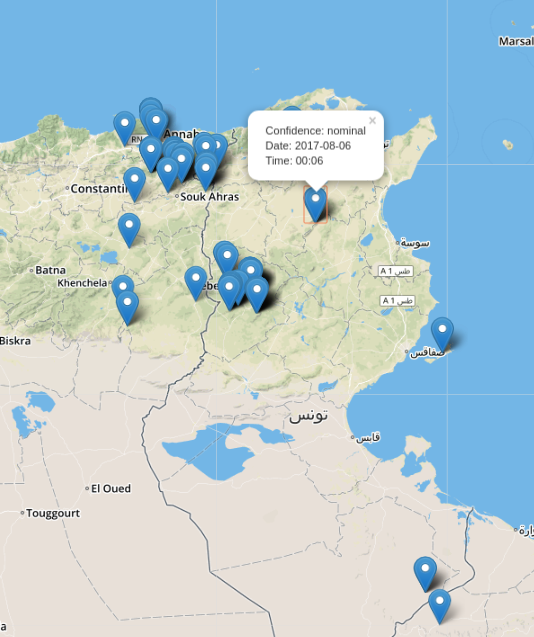

# Wildfire Activity in Tunisia

A simple web app that uses NASA's Active Fire Data to monitor wildfire in Tunisia.


# Usage:
- Put credentials in conf.py

- ```python web_app.py```

- Point browser to ```localhost:8080\active-fires

# Screenshot
